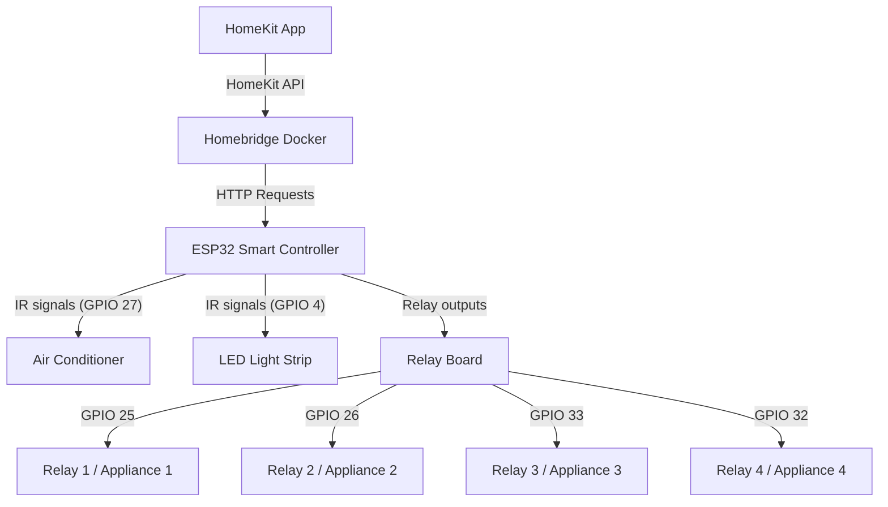
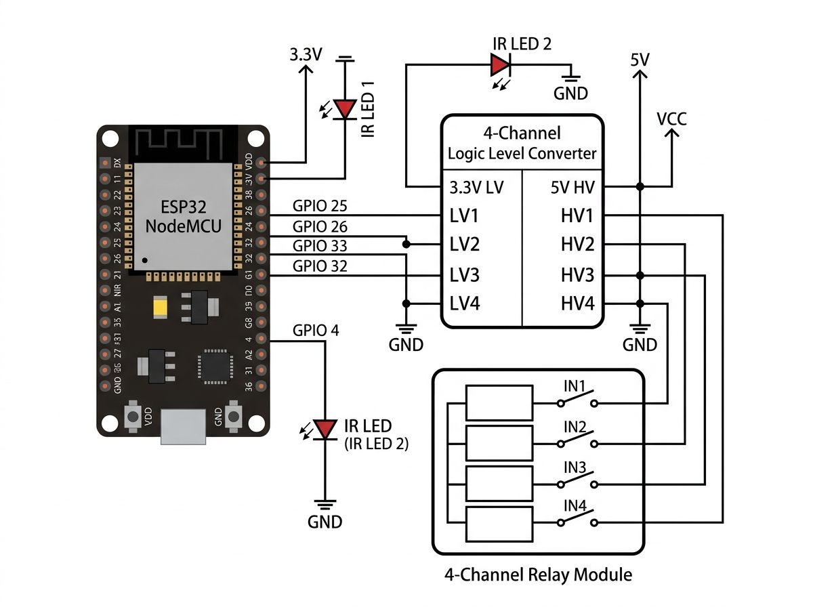
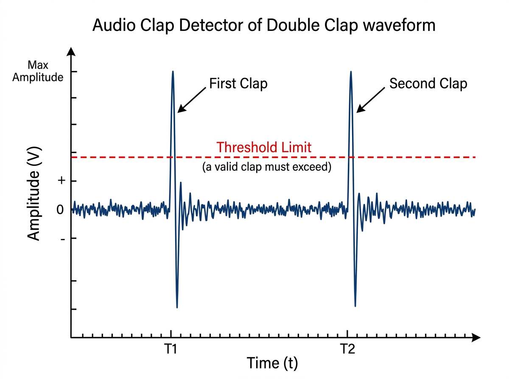

# ESP32 HomeKit & Homelab Controller

This repository contains the firmware, configurations, and scripts for a smart home integration system centered around Homebridge and an ESP32 microcontroller to control AC units, RGB LED light strips, and relay-controlled lighting.

## System Architecture

The deployment consists of a central homelab server running Homebridge, which bridges custom ESP32 microcontrollers and relay channels directly into Apple HomeKit.



---

## Hardware & Connections

The smart home controllers utilize an **ESP32 (NodeMCU v1.1)** to transmit IR codes directly to local appliances and control a 5V 4-channel relay board through a logic level converter (shifting 3.3V GPIO outputs to 5V signals).

### Wiring & Schematic Diagram

Below is the connection schematic for the ESP32, dual IR transmitters, and the 4-channel relay module:



### ESP32 Pinout Configuration

| Component / Function | ESP32 GPIO Pin | Description |
| :--- | :--- | :--- |
| **AC IR Transmitter** | `GPIO 27` | Outputs IR signals to control Air Conditioning unit commands |
| **LED Strip IR Transmitter** | `GPIO 4` | Outputs IR signals to control RGB LED strip functions |
| **Status Indicator LED** | `GPIO 2` | Onboard blue LED indicating activity and command transmissions |
| **Relay 1 Control** | `GPIO 25` | Outputs 3.3V signals to Level Converter (shifts to 5V IN1 on Relay Board) |
| **Relay 2 Control** | `GPIO 26` | Outputs 3.3V signals to Level Converter (shifts to 5V IN2 on Relay Board) |
| **Relay 3 Control** | `GPIO 33` | Outputs 3.3V signals to Level Converter (shifts to 5V IN3 on Relay Board) |
| **Relay 4 Control** | `GPIO 32` | Outputs 3.3V signals to Level Converter (shifts to 5V IN4 on Relay Board) |

### Firmware
Use the latest complete sketch:
*   **`homekit_full.ino`**: The latest, feature-complete Arduino sketch implementing dual IR transmitters (AC & LED) and 4-channel relay controls for room lighting.
*   `esp32_ac_controller.ino`: Legacy/minimal version focusing primarily on IR control.

### Audio Clap Detector

The repository includes `ac_clap_detector.c`, which detects a double-clap pattern. A valid double-clap is identified by two distinct, high-amplitude, narrow (small-width) spikes in sound level that exceed a threshold limit within a defined time window:



---

## Deployment

The homelab runs on Docker. An example stack configuration is provided in `docker-compose.example.yml`.

### Services

1. **Homebridge (`homebridge`)**: Exposes local switches, thermostats, and controllers to Apple HomeKit. Run in `host` network mode to allow local mDNS discovery.
2. **Eclipse Mosquitto (`mosquitto`)**: Lightweight MQTT broker for message passing and local device coordination.

### Quick Start

1. Copy the example configuration files to configure your environment:
   ```bash
   cp config.example.json homebridge_config/config.json
   cp docker-compose.example.yml docker-compose.yml
   ```
2. Open `homebridge_config/config.json` and customize your Homebridge PIN, usernames, and ESP32 IP address parameters.
3. Start the deployment:
   ```bash
   docker compose up -d
   ```
